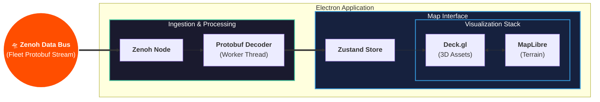

# OpenC2 🛰️

## 📖 Overview

**OpenC2** is a high-performance Command and Control interface built with Electron and React. It is designed to bridge the critical gap between low-level debugging (RViz) and legacy ground stations (MissionPlanner). 

While traditional tools are often too resource-heavy for field use or too rigid to scale, OpenC2 utilizes a **multi-threaded, binary-first architecture** to handle high-frequency ROS2 telemetry across diverse robotic fleets.


## 🏗️ System Architecture

OpenC2 prioritizes **Data Sovereignty** and **Low-Latency Ingestion**. By utilizing a custom protocol interceptor within an Electron wrapper, the system remains fully operational in denied, air-gapped environments.

### The Pipeline
1. **Ingestion:** Raw **UDP Datagrams** are captured via a **Zenoh** node.
2. **Processing:** **Protobuf** payloads are decoded in a dedicated **Renderer Worker** thread to maintain a 60FPS "glass cockpit" experience.
3. **Visualization:** Decoded data is piped to a **Zustand** store, triggering reactive updates in the **Deck.gl** and **MapLibre** stack.



## 🛠️ Technical Pillars

### 1. Deck.gl Rendering Engine
Serves as the heavy-lift visualization engine, interleaved directly into the MapLibre render loop.


* **Terrain Masking:** Enables 3D assets to correctly intersect with hillshading and buildings rather than simply floating on top.
* **Synchronized Z-Axis:** Strictly syncs `terrainExaggeration` and `elevationOffset` to ensure dynamic asset coordinates match the map's vertical scaling in real-time.
* **Instance Reactive Elements:** Renders thousands of entities (robots, breadcrumbs, frustums) in a single draw call via WebGL/WebGPU for maximum performance.

### 2. Protobuf Ingestion Pipeline
Bypasses the "JSON bottleneck" by decoding binary streams directly into the application state.


* **Type Parity:** Compiles `.proto` definitions into static JS modules for 1:1 parity with ROS2 messages.
* **Structured Cloning:** Passes decoded POJOs (Plain Old JavaScript Objects) from workers to the UI thread to keep the main loop responsive at 60FPS.

### 3. Data Sovereign Spatial Context
* **OpenFreeMap Fork:** A local style schema fork that strips civilian noise (POIs) and highlights tactical features.
* **PMTiles Support:** Host the planet (or mission-specific AOIs) via a 100GB+ local archive for fully air-gapped operations.
* **Protocol Interceptor:** Maps `tiles://` requests directly to local storage, ensuring zero reliance on external networks or public APIs.

### 4. Tactical Markup
Drawing and editing geographic features directly on the map using **`@deck.gl-community/editable-layers`** (the deck.gl v9 successor to Nebula.gl).

* **Standalone Deck Instance:** A `Deck` overlay sits on top of MapLibre and owns all pointer events. MapLibre renders tiles only (`interactive: false`), while `Deck` drives navigation and drawing. The two stay in sync via `map.jumpTo()` on every view state change. This architecture is required because `EditableGeoJsonLayer` needs direct pointer events on the deck canvas to place vertices on empty map space — `MapboxOverlay` cannot provide this since its canvas uses `pointer-events: none`.
* **EditableGeoJsonLayer:** Supports `DrawPolygonMode`, `DrawLineStringMode`, `DrawPointMode`, `ModifyMode`, and `ViewMode`. Click to place vertices, double-click to finish a polygon. The layer manages a `FeatureCollection` in React state and auto-switches to Select mode after each feature is drawn.
* **Webpack Bundler:** deck.gl v9 is distributed as ES modules and requires a build step. The renderer is bundled with webpack (`electron-renderer` target) and the output is loaded by the Electron HTML shell from `dist/renderer.bundle.js`.
* **Terrain-Aware Draping:** Waypoints and perimeters "clamp" to the `raster-dem` elevation model.
* **Volumetric Fences:** 3D extrusions for visualizing vertical geofences and "Safe Altitude" corridors.

---

## 🚀 Stack

| Layer | Technologies |
| :--- | :--- |
| **Robotics** | ROS2, Zenoh, Gazebo Sim, Docker |
| **Frontend** | React, Electron, Zustand, TypeScript |
| **Graphics** | Deck.gl, MapLibre (WebGL/WebGPU), @deck.gl-community/editable-layers |
| **Data** | Protobuf, PMTiles, Uint8Array Streams |

## 🗺️ Roadmap

### Phase I: Data Fidelity
- [ ] **Satellite Integration:** Photographic ground truth for terminal-phase views.
- [ ] **Procedural Extrusions:** On-the-fly 3D urban geometry generation from map metadata.
- [ ] **LiDAR/Photogrammetry Patching:** Centimeter-accurate terrain overrides for specific Areas of Interest (AOIs).

### Phase II: Command & Sensory Integration
- [ ] **WebRTC Pipeline:** Low-latency (<300ms) glass-to-glass video streaming for real-time verification.
- [ ] **Interest-Driven Uplink:** "Silent-Running" state that only triggers high-bandwidth streams upon edge-detection alerts.
- [ ] **Augmented Sensor Frustums:** Projecting camera FOV footprints as dynamic 3D meshes on the terrain using gimbal telemetry.

---

## 🤝 Contributing

OpenC2 is a research project. We welcome contributions that focus on performance optimizations in the telemetry pipeline or advanced spatial visualization.

1.  **Clone the repository:** `git clone https://github.com/EthanMBoos/OpenC2.git`
2.  **Install dependencies:** `npm install`
3.  **Build & launch:** `npm start` (runs webpack then Electron)
4.  **Watch mode (optional):** Run `npm run watch` in one terminal, then `npx electron .` in another for live rebuilds.

> **Build step**
> The renderer uses ES `import` syntax for deck.gl and editable-layers, which requires a webpack bundle.
> `npm run build` outputs `dist/renderer.bundle.js`, which the Electron HTML shell loads.
> In development, `npm run watch` rebuilds automatically on file changes.

> **Drawing on the map**
> Use the toolbar on the left side of the map:
> - **Select** — pan/zoom the map
> - **Polygon / Line / Point** — click to place vertices, double-click to finish
> - **Modify** — drag vertices of existing features
>
> The cursor changes to a crosshair when a drawing mode is active.

> **Map testing**
> For early development you can point MapLibre at a public style URL such as the OpenFreeMap ’liberty’ style. The renderer already includes a `MapComponent` that loads:
> ```js
> style: 'https://tiles.openfreemap.org/styles/liberty'
> ```
> Once you switch to self-hosted tiles or your own style JSON, simply update the `style` property or intercept `tiles://` requests accordingly.

