# OpenC2

## 📖 Overview
**OpenC2** is a high-performance Command and Control interface built with Electron and React. It is designed to bridge the critical gap between low-level debugging (RViz) and legacy ground stations (MissionPlanner). 

While traditional tools are often too resource-heavy for field use or too rigid to scale, OpenC2 utilizes a **multi-threaded, binary-first architecture** to handle high-frequency ROS2 telemetry across diverse robotic fleets.

## 🏗️ System Architecture
OpenC2 prioritizes **Data Sovereignty** and **Low-Latency Ingestion**. By utilizing a custom protocol interceptor within an Electron wrapper, the system remains fully operational in denied, air-gapped environments.

```mermaid
flowchart LR
    %% External Fleet
    Fleet(("🛸 UDP Data Bus<br/>(Protobuf Stream)"))

    %% Headless Data Gateway (Go)
    subgraph GoGateway ["Go Telemetry Gateway (Sidecar)"]
        direction TB
        UDP_Listener["net.ListenUDP<br/>(Goroutine)"]
        Pool["sync.Pool<br/>(Object Reuse)"]
        Decoder["Protobuf Decoder<br/>(proto.Unmarshal)"]
        WsServer["WebSocket Server<br/>(gorilla/websocket)"]
        
        UDP_Listener --> Pool
        Pool --> Decoder --> WsServer
    end

    %% Main C2 Client
    subgraph Electron ["Electron Application (Frontend)"]
        direction LR
        WsClient["Zustand WS Client<br/>(Stream Ingest)"]

        subgraph UI ["Map Interface (60FPS)"]
            State["React State<br/>(Zustand)"]
            
            subgraph Map ["Visualization Stack"]
                direction TB
                Deck["Deck.gl<br/>(Interleaved Layers)"]
                MapLibre["MapLibre<br/>(3D Terrain)"]
            end
            
            State --> Deck
            Deck <--> MapLibre
        end
        WsClient --> State
    end

    %% Connections
    Fleet ==> UDP_Listener
    WsServer == "JSON/POJO Stream" ==> WsClient

    %% Styling
    classDef bus fill:#ff4e00,stroke:#fff,stroke-width:2px,color:#fff;
    classDef backend fill:#00add8,stroke:#fff,stroke-width:2px,color:#fff;
    classDef ui fill:#16213e,stroke:#3498db,stroke-width:2px,color:#fff;

    class Fleet bus;
    class GoGateway backend;
    class Electron,UI,Map ui;
```

## 🛠️ Technical Pillars

### 1. Data Sovereign Spatial Context
* **OpenFreeMap Fork:** A local style schema fork that strips civilian noise (POIs) and highlights tactical features.
* **PMTiles Support:** Host the planet (or mission-specific AOIs) via a 100GB+ local archive for fully air-gapped operations.
* **Protocol Interceptor:** Maps `tiles://` requests directly to local storage, ensuring zero reliance on external networks or public APIs.

### 2. Deck.gl + MapLibre Interleaved Rendering
Uses the `MapboxOverlay` from `@deck.gl/mapbox` in **interleaved mode** to share a single WebGL context with MapLibre. This architecture eliminates Electron compositing bugs and guarantees proper 3D depth sorting between map tiles and deck.gl layers.

* **Shared WebGL Context:** `MapboxOverlay` is added as a MapLibre control, avoiding separate canvas stacking issues common in Electron.
* **Dynamic Terrain Elevation:** When 3D terrain is enabled, geometry coordinates are transformed via `map.queryTerrainElevation()` to follow the terrain surface.
* **Depth Parameter Management:** Sublayer depth testing (`depthWriteEnabled`, `depthCompare`) is configured to ensure proper rendering order with terrain.

### 3. Tactical Markup
Drawing and editing geographic features directly on the map using **`@deck.gl-community/editable-layers`** (the deck.gl v9 successor to Nebula.gl).

* **Interleaved Overlay Architecture:** Uses `MapboxOverlay` in interleaved mode with MapLibre `interactive: true`. MapLibre handles pan/zoom in view mode, while `dragPan` is disabled during drawing to let editable-layers capture mouse events. Double-click events are intercepted at the DOM level and injected into Deck.gl's event bus to properly finish shapes.
* **EditableGeoJsonLayer:** Supports `DrawPolygonMode`, `DrawLineStringMode`, `DrawPointMode`, `ModifyMode`, and `ViewMode`. Click to place vertices, double-click to finish. Auto-switches to Select mode after each feature is drawn.
* **Mission Object Types:**
  - **NFZ (No-Fly Zone):** Red polygons with configurable floor and ceiling altitudes, rendered as 3D boxes with walls and ceiling
  - **Geofence:** Orange curtain walls (no ground fill), rendered as vertical quads with configurable altitude
  - **Search Zone:** Blue polygons with an elevated ceiling layer at configurable altitude
  - **Route:** Emerald green line paths rendered at configurable altitude
  - **Search Point:** Blue point markers placed via single click
* **Property Panel:** After drawing a feature, a side panel opens to configure altitude parameters (floor/ceiling for NFZ, altitude for others).
* **3D Visualization Layers:** Features are rendered using `SolidPolygonLayer` for walls/ceilings and `PathLayer` for routes/borders, all with proper depth testing.

### 4. The Pipeline
* **Ingestion (Headless Gateway):** Raw UDP Datagrams are captured via a dedicated Go sidecar daemon.
* **Processing & Caching:** The Go gateway decodes Protobuf payloads in real-time, utilizing object reuse via sync.Pool to drastically reduce garbage collection pressure and avoid repeated memory allocations, which maintains a strictly deterministic, low-latency in-memory state of the fleet.
* **Distribution:** Clean, decoded telemetry is streamed to the frontend via a local WebSocket port listener.
* **Visualization:** Decoded Plain Old JavaScript Objects (POJOs) pipe directly from the local stream client into a Zustand store, triggering reactive updates in the Deck.gl and MapLibre stack at a steady 60FPS.

## 🚀 Stack
| Layer | Technologies |
| :--- | :--- |
| **Frontend** | React, Electron, JavaScript |
| **Backend Gateway** | Go, Goroutines, WebSockets, sync.Pool |
| **Graphics** | Deck.gl, MapLibre (WebGL), @deck.gl-community/editable-layers |
| **Data** | Protobuf, PMTiles, Uint8Array Streams |

## 🗺️ Roadmap
### Phase I: Data Fidelity
- [x] **Satellite Integration:** ESRI World Imagery base layer toggle for aerial context.
- [x] **3D Terrain:** MapLibre native terrain with raster-dem source and hillshading.
- [x] **Tactical Markup & Editing:** Mission element drawing in 2D/3D with automatic terrain draping (curtains/walls) and intuitive geometry editing.
- [ ] **Air-Gapped Map Storage:** Full offline PMTiles integration for both routing basemaps and high-resolution 3D terrain data.

### Phase II: Command & Sensory Integration
- [ ] **Headless Go Server:** Extract raw UDP/Protobuf ingestion from the radio link into a separate Go backend repository.
- [ ] **Reactive UI Transport:** Expose a local WebSocket server from the Go sidecar and implement the Zustand WebSocket client in React to stream telemetry directly to the UI without blocking Electron's event loop.
- [ ] **Memory & Deserialization Optimization:** Implement object reuse via sync. Pool for Protobuf deserialization to drastically reduce garbage collection pressure and maintain strict, low-latency execution.
- [ ] **Lifecycle Orchestration:** Launch and manage the compiled Go binary using Electron's utilityProcess API instead of standard Node.js child processes, ensuring the sidecar is cleanly terminated if the main interface exits or crashes.

### Phase III: Command & Sensory Integration
- [ ] **Augmented Sensor Frustums:** Projecting camera FOV footprints and planned paths as dynamic 3D meshes on the terrain using gimbal telemetry.
- [ ] **WebRTC Pipeline:** Low-latency (<300ms) glass-to-glass video streaming for real-time verification.
- [ ] **Interest-Driven Uplink:** "Silent-Running" state that only triggers high-bandwidth streams upon edge-detection alerts.

## 🤝 Contributing
OpenC2 is a research project. We welcome contributions that focus on performance optimizations in the telemetry pipeline or advanced spatial visualization.

1.  **Clone the repository:** `git clone https://github.com/EthanMBoos/OpenC2.git`
2.  **Install dependencies:** `npm install`
3.  **Build & launch:** `npm start` (runs webpack then Electron)
4.  **Watch mode (optional):** Run `npm run watch` in one terminal, then `npx electron .` in another for live rebuilds.

> **Build step**
> The renderer uses ES `import` syntax for deck.gl and editable-layers, which requires a webpack bundle.
> `npm run build` outputs `dist/renderer.bundle.js`, which the Electron HTML shell loads.
> In development, `npm run watch` rebuilds automatically on file changes.

> **Drawing on the map**
> Double-click on empty map space to open the **Mission Objects** context menu, then select a feature type:
> - **NFZ** — Draw a no-fly zone polygon (red)
> - **Search Zone** — Draw a search area polygon (blue)
> - **Geofence** — Draw a geofence boundary with vertical walls (orange)
> - **Route** — Draw a flight path line (green)
> - **Search Point** — Place a point marker (blue)
>
> Click to place vertices, double-click to finish. After drawing, a property panel opens to configure altitude settings.
> Double-click an existing feature to modify it. Press `Delete`/`Backspace` to remove selected features.
> The cursor changes to a crosshair when a drawing mode is active.

> **Map controls**
> - **3D/2D Toggle** (top-right): Enable/disable 3D terrain with hillshading
> - **Satellite Toggle** (top-right): Switch between OpenFreeMap street style and ESRI satellite imagery
> - When terrain is enabled, drag-rotate and touch-rotate are unlocked for 3D navigation
>
> The default style is OpenFreeMap 'liberty'. Terrain tiles are sourced from Mapterhorn.
