# OpenC2 🛰️

## 📖 Overview

**OpenC2** is a high-performance Command and Control interface built with Electron and React. It is designed to bridge the critical gap between low-level debugging (RViz) and legacy ground stations (MissionPlanner). 

While traditional tools are often too resource-heavy for field use or too rigid to scale, OpenC2 utilizes a **multi-threaded, binary-first architecture** to handle high-frequency ROS2 telemetry across diverse robotic fleets.


## 🏗️ System Architecture

OpenC2 prioritizes **Data Sovereignty** and **Low-Latency Ingestion**. By utilizing a custom protocol interceptor within an Electron wrapper, the system remains fully operational in denied, air-gapped environments.

### The Pipeline
1. **Ingestion:** Raw **UDP Datagrams** are captured via a **Zenoh** node.
2. **Processing:** **Protobuf** payloads are decoded in a dedicated **Renderer Worker** thread to maintain a 60FPS "glass cockpit" experience.
3. **Visualization:** Decoded data is piped to a **Zustand** store, triggering reactive updates in the **Deck.gl** and **MapLibre** stack.

```mermaid
flowchart LR
    %% External Fleet
    Fleet(("🛸 <b>Zenoh Data Bus</b><br/>(Fleet Protobuf Stream)"))

    subgraph Electron ["Electron Application"]
        direction LR

        %% Data Handling
        subgraph Pipeline ["Ingestion & Processing"]
            Z_Node["<b>Zenoh Node</b>"]
            Decoder["<b>Protobuf Decoder</b><br/>(Worker Thread)"]
            
            Z_Node --> Decoder
        end

        %% Visualization
        subgraph UI ["Map Interface"]
            State["<b>Zustand Store</b>"]
            
            subgraph Map ["Visualization Stack"]
                direction TB
                Deck["<b>Deck.gl</b><br/>(3D Assets)"]
                MapLibre["<b>MapLibre</b><br/>(Terrain)"]
            end
            
            State --> Deck
            Deck <--> MapLibre
        end
    end

    %% Main Connection
    Fleet ==> Z_Node
    Decoder ==> State

    %% Styling
    classDef bus fill:#ff4e00,stroke:#fff,stroke-width:2px,color:#fff;
    classDef pipe fill:#1a1a2e,stroke:#4ecca3,stroke-width:2px,color:#fff;
    classDef ui fill:#16213e,stroke:#3498db,stroke-width:2px,color:#fff;

    class Fleet bus;
    class Pipeline pipe;
    class UI,Map ui;
```



## 🛠️ Technical Pillars

### 1. Deck.gl Rendering Engine
Serves as the heavy-lift visualization engine, interleaved directly into the MapLibre render loop.


* **Terrain Masking:** Enables 3D assets to correctly intersect with hillshading and buildings rather than simply floating on top.
* **Synchronized Z-Axis:** Strictly syncs `terrainExaggeration` and `elevationOffset` to ensure dynamic asset coordinates match the map's vertical scaling in real-time.
* **Instance Reactive Elements:** Renders thousands of entities (robots, breadcrumbs, frustums) in a single draw call via WebGL/WebGPU for maximum performance.

### 2. Protobuf Ingestion Pipeline
Bypasses the "JSON bottleneck" by decoding binary streams directly into the application state.


* **Type Parity:** Compiles `.proto` definitions into static JS modules for 1:1 parity with ROS2 messages.
* **Structured Cloning:** Passes decoded POJOs (Plain Old JavaScript Objects) from workers to the UI thread to keep the main loop responsive at 60FPS.

### 3. Data Sovereign Spatial Context
* **OpenFreeMap Fork:** A local style schema fork that strips civilian noise (POIs) and highlights tactical features.
* **PMTiles Support:** Host the planet (or mission-specific AOIs) via a 100GB+ local archive for fully air-gapped operations.
* **Protocol Interceptor:** Maps `tiles://` requests directly to local storage, ensuring zero reliance on external networks or public APIs.

### 4. Tactical Markup
* **Nebula.gl:** Mouse-driven 3D drawing for mission planning and real-time edits.
* **Terrain-Aware Draping:** Waypoints and perimeters "clamp" to the `raster-dem` elevation model.
* **Volumetric Fences:** 3D extrusions for visualizing vertical geofences and "Safe Altitude" corridors.

---

## 🚀 Stack

| Layer | Technologies |
| :--- | :--- |
| **Robotics** | ROS2, Zenoh, Gazebo Sim, Docker |
| **Frontend** | React, Electron, Zustand, TypeScript |
| **Graphics** | Deck.gl, MapLibre (WebGL/WebGPU), Nebula.gl |
| **Data** | Protobuf, PMTiles, Uint8Array Streams |

## 🗺️ Roadmap

### Phase I: Data Fidelity
- [ ] **Satellite Integration:** Photographic ground truth for terminal-phase views.
- [ ] **Procedural Extrusions:** On-the-fly 3D urban geometry generation from map metadata.
- [ ] **LiDAR/Photogrammetry Patching:** Centimeter-accurate terrain overrides for specific Areas of Interest (AOIs).

### Phase II: Command & Sensory Integration
- [ ] **WebRTC Pipeline:** Low-latency (<300ms) glass-to-glass video streaming for real-time verification.
- [ ] **Interest-Driven Uplink:** "Silent-Running" state that only triggers high-bandwidth streams upon edge-detection alerts.
- [ ] **Augmented Sensor Frustums:** Projecting camera FOV footprints as dynamic 3D meshes on the terrain using gimbal telemetry.

---

## 🤝 Contributing

OpenC2 is a research project. We welcome contributions that focus on performance optimizations in the telemetry pipeline or advanced spatial visualization.

1.  **Clone the repository:** `git clone https://github.com/EthanMBoos/OpenC2.git`
2.  **Install dependencies:** `npm install`
3.  **Launch dev environment:** `npm run dev`

> **Electron**
> After installing, start the Electron application with:
> ```sh
> npm start
> ```
> This opens the initial window where the React renderer is mounted. A placeholder message is shown; the map will be added here later.

> **Map testing**
> For early development you can point MapLibre at a public style URL such as the OpenFreeMap ’liberty’ style. The renderer already includes a `MapComponent` that loads:
> ```js
> style: 'https://tiles.openfreemap.org/styles/liberty'
> ```
> Once you switch to self-hosted tiles or your own style JSON, simply update the `style` property or intercept `tiles://` requests accordingly.

